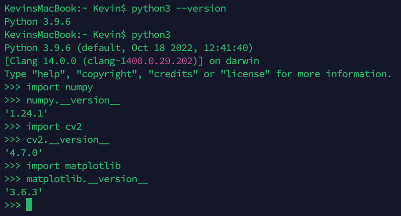

### 基于OPENCV实现简单人脸识别
> 实现人脸识别的主要步骤：   
>   
> 流程大致如此，在此之前，要先让人脸被准确的找出来，也就是能准确区分人脸的分类器，在这里我们可以用已经训练好的分类器，网上种类较全，
> 分类准确度也比较高，我这里直接用opencv的分类器（https://github.com/opencv/opencv/tree/4.x/data）  

### 1. 准备：
| 工具                    | 版本   |
|------------------------|--------|
| python                 | 3.9.6  |
| numpy                  | 1.24.1 |
| opencv                 | 4.7.0  |
| matplotlib             | 3.6.3  |
| opencv-contrib-python  | 4.7.0  |

> numpy 安装  
> $ pip3 install -i https://pypi.tuna.tsinghua.edu.cn/simple numpy  

> opencv 安装  
> $ pip3 install -i https://pypi.tuna.tsinghua.edu.cn/simple opencv-python  

> matplotlib 安装  
> $ pip3 install -i https://pypi.tuna.tsinghua.edu.cn/simple matplotlib  

> opencv-contrib-python 安装  
> $ pip3 install -i https://pypi.tuna.tsinghua.edu.cn/simple opencv-contrib-python

> 验证安装  
>   

### 2. 三种人脸识别方法介绍  
> LBPH(Local Binary Patterns Histogram)：  
> 局部二值模式直方图，使用的模型基于局部二值模式(Local Binary Patterns , LBP)算法。  
> LBP最早是被作为一种有效的纹理描述算子提出的，在表述图像局部纹理特征上效果出众。  
>  
> EigenFaces:  
> 通常也被称为特征脸，它使用主成分分析(Principal Component Analysis , PCA)方法，  
> 将高维的人脸数据处理为低维数据（降维）后，再进行数据分析和处理，获取识别结果。
>  
> Fisherfaces:  
> 采用线性判别分析(Linear Discriminant Analysis , LDA)方法实现人脸识别，也被称为“Fisher判别分析法”。  

> confidence(置信度)  
> 置信度评分用来衡量识别结果与原有模型之间的距离。0 表示完全匹配。  
> 在LBPH中：通常情况下，认为小于50的值是可以接受的，如果该值大于80则认为差别较大。  
> 在EigenFaces中：值通常在0~20000之间，只要低于5000都被认为是相当可靠的识别结果。  
> 在Fisherfaces中：值通常在0~20000之间，只要低于5000都被认为是相当可靠的识别结果。  

### 3. 特别注意  
> 使用LBPH人脸识别，对被比较图片和待识别图片无要求。但使用EigenFaces和Fisherfaces人脸识别，被比较图片和待识别图片必须为相同的size。

### 4. 代码说明
> fetch_face_sample.py  
> 采集待训练的人脸数据  

> build_face_model.py  
> 用上一步采集的人脸数据建立人脸模型

> check_face_model.py  
> 检测，校验，输出结果
